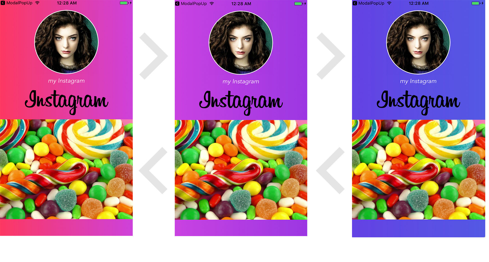

# About GradientAnimateView

## 概要
- 画面の背景にアニメーションでカラーグラデーションのループを表現するチュートリアルを身につける
- グラデーションを表現するためにカスタムUIViewを作成
- グラデーションする仕組みはカスタムUIViewにStartColor,EndColorのプロパティにDidSetObserverを設け、色が設定されたら次の色を設定するようにループさせる
## スクリーンショット

